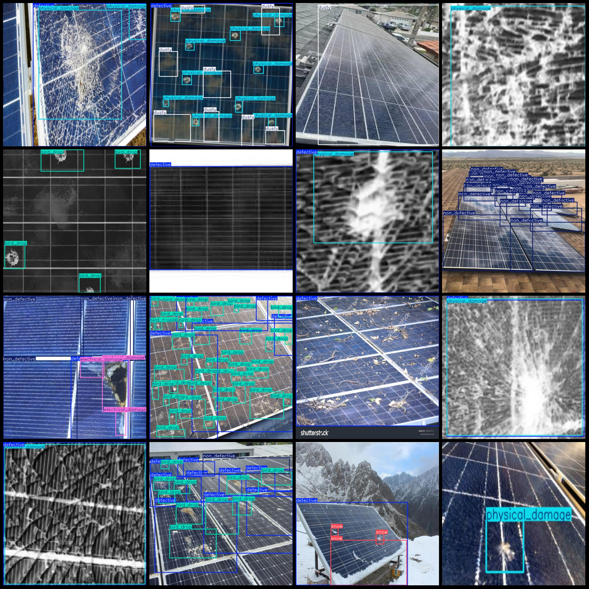
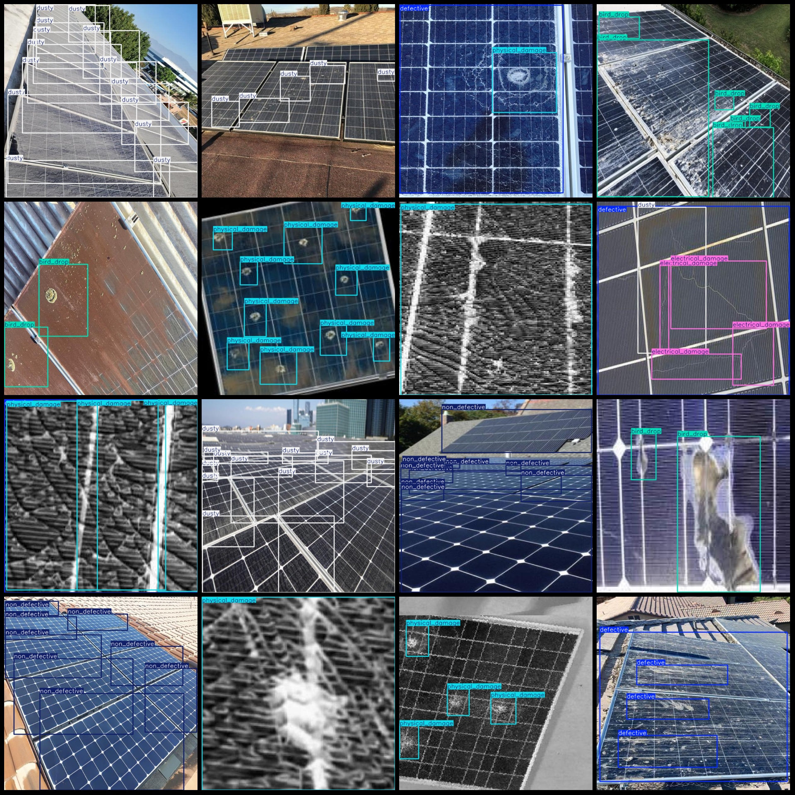

# Solar Photovoltaic Panel Defect Detection Dataset in VOC+YOLO Format with 856 Images and 7 Categories

## Dataset format: Pascal VOC format + YOLO format (txt file without segmentation paths, just containing jpgImages and corresponding VOC format xml files and yolo format txt files)

### Number of images (jpg file count): 856
### Number of annotations (xml file count): 856
### Number of annotations (txt file count): 856
### Number of annotation categories: 7
### Annotation category names: ["bird_drop", "defective", "dusty", "electrical_damage", "non_defective", "physical_damage", "snow"]

#### Each category labeled boxes count:
- bird_drop (bird dropping) = 917, occupied images = 80
- defective (defective/bad) = 822, occupied images = 365
- dusty (dusted/dirty) = 676, occupied images = 144
- electrical_damage (electrical damage) = 223, occupied images = 90
- non_defective (non-defective/good) = 1499, occupied images = 220
- physical_damage (physical damage) = 1019, occupied images = 403
- snow (snow) = 486, occupied images = 66

#### Total number of frames: 5642
#### Image resolution: 640x640
#### Using labelImg tool for annotation: labelImg
#### Annotation rules: draw rectangles on the categories
#### Important note: The dataset does not have split into training validation test sets. You need to do it yourself.
#### Special statement: This dataset does not guarantee the accuracy of the trained model or the weight files.

Preview of Images:
## Images

Here is a pay link on Stripe ( https://buy.stripe.com/3cs8yP7sY87d0vu9AB ). Please contact me lonlonago@foxmail.com after funding $89, and I will send you a complete data files , thank you!

